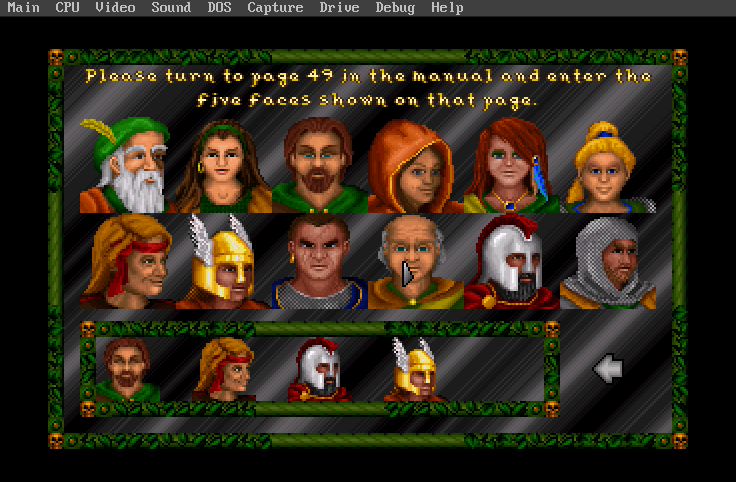
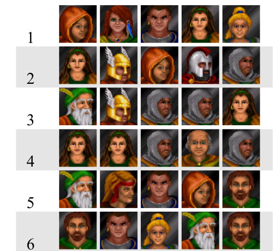

+++
title = "How I Rang In 2024"
subtitle = "or, copy protection from 1992"

# Add a summary to display on homepage (optional).
summary = ""

date = 2024-01-03T13:00:00-05:00
draft = false

# Authors. Comma separated list, e.g. `["Bob Smith", "David Jones"]`.
authors = []

# Is this a featured post? (true/false)
featured = false

# Tags and categories
# For example, use `tags = []` for no tags, or the form `tags = ["A Tag", "Another Tag"]` for one or more tags.
tags = []
categories = []

# Projects (optional).
#   Associate this post with one or more of your projects.
#   Simply enter your project's folder or file name without extension.
#   E.g. `projects = ["deep-learning"]` references 
#   `content/project/deep-learning/index.md`.
#   Otherwise, set `projects = []`.
projects = []

# Featured image
# To use, add an image named `featured.jpg/png` to your page's folder. 
[image]
  # Caption (optional)
  caption = ""

  # Focal point (optional)
  # Options: Smart, Center, TopLeft, Top, TopRight, Left, Right, BottomLeft, Bottom, BottomRight
  focal_point = ""
+++

A project I've been noodling with for the last few years (okay a lot of years) has been reverse engineering the file formats for the game [The Summoning](https://en.wikipedia.org/wiki/The_Summoning_(video_game)).  This has led to things like learning [kaitai.io](https://kaitai.io), digging into [DOSbox](https://github.com/matthewturk/jupyterlab_dosbox), [Ghidra](https://ghidra-sre.org/) (and writing [some scripts](https://github.com/matthewturk/ghidra-msdos-syscalls)), and exploring lots of things in a [parsing library](https://github.com/matthewturk/dispersing/).  I even [live streamed](https://www.youtube.com/watch?v=2v5CBW3yGi0) some reversing work and a walkthrough of my efforts a while back.

I played this game as a kid.  It came out in 1992, and my grandfather bought it for us.  It's ... long.  Like, really, really, *really* long.  And there's a plot!  With NPCs!  (In fact, the person who designed the plot now runs a rather awesome [Science Fiction Magazine](https://dreamforgemagazine.com/))  But it's also kind of ... grindy?

Anyway, it has its fans online, although the spiritual sequel [Veil of Darkness](https://en.wikipedia.org/wiki/Veil_of_Darkness) seems to be an awful lot more popular; [David L. Craddock](https://davidlcraddock.com/) even did an oral history of it which he included in the book *Game Dev Stories 5*, which seems to be rather tricky to get ahold of lately.  (I snagged it in a [Storybundle](https://storybundle.com/books/3182)).

Both The Summoning and Veil of Darkness have recently been released on [GOG](https://gog.com) and [Steam](https://steampowered.com/).

There are still lots of mysteries for the code to give up, but I find it absolutely fascinating to dig in and learn about the different ways that the developers did things.  Honestly, it's just incredible to be able to appreciate the craft of their work -- and seeing how they saved space in some ways, how they used swap files, and learn about how they operated within the confines of the MS-DOS era.  I've been tempted a few times to try to reach out to one or more of them, but have always been a bit too afraid to.

One of the biggest mysteries -- which I am certain has been discovered by others, but which I did not -- was how the game's copy protection worked.  When you start the game, it shows a screen like this:



(In this case though I've put the first four faces in already.)  My assumption had *always* been that the *correct* ordering of the faces was stored somewhere in either the executable or in one of the affiliated data files, likely in an obfuscated fashion.  But finding out precisely where they were ... that had eluded me.

**UNTIL NOW!**

(Using that phrasing is a joke that only hard-core TheSummoning-heads will get.  Haha, right?)

I recently took the time to implement a script that converted references in Ghidra to segmented memory references, defaulting to pointing at the local `DS` section.  (Of course I don't automate all of it -- I hardcode the `DS`!)  This really helped me understand where strings were used.  And shortly after this, I was able to finally understand how the string formatting function worked, and so I found myself knowing where the string "Please turn to page" was being fed in, and the number that arrived just after it -- the page number.  With a bit of work, I dug deeper and found a function that Ghidra decompiled into:

```c
  iVar1 = page_number + 1;
  iVar2 = iVar1;
  for (iVar4 = 1; iVar4 < 6; iVar4 = iVar4 + 1) {
    iVar2 = (iVar4 + page_number) % 5;
    iVar3 = (iVar1 * iVar2 * iVar2 * iVar2 + iVar2 * 0x45 + iVar1 * 0x2f) % 0x8b;
    iVar2 = iVar3 / 0xc;
    *(int *)((int)&DAT_235b_44ec + (iVar4 + -1) * 2) = iVar3 % 0xc;
  }
  return iVar2;
```

Huh.  This was where things got interesting.  I had assumed that if things had been procedurally generated, at least one of the numbers that showed up would be the number of pages in the manual or something like that.  But this ... was not featuring any of those.

And yet.

One of the difficult things for me is understanding how the graphics are done.  I'm still learning, but I believe the software uses software interrupt 60 to signal that sprites or text or other things are ready to be written to the screen.  (Maybe.)  But where they were stored in memory was tricky, and so I was not entirely sure that I understood precisely where to look for memory accesses to see where the drawing would take place.

What grabbed my attention here was the `0xc`.  I'm not the kind of person who can effortlessly convert back and forth to hex, but I recognized that as 12 -- the same as the number of faces we have to choose from.  And also, it only has one parameter -- the page number.

I coded this up in Python:

```python
vals = {}
for page_i in range(15):
    vals[page_i] = []
    iVar1 = page_i + 1
    ivar2 = iVar1
    for iVar4 in range(1, 6):
        iVar2 = (iVar4 + page_i) % 5
        iVar3 = (iVar1 * iVar2 * iVar2 * iVar2 + iVar2 * 0x45 + iVar1 * 0x2f) % 0x8b
        iVar2 = iVar3 / 0xc
        vals[page_i].append(iVar3 % 0xc)
    print(f"{page_i: 2d}: {vals[page_i]}")
```

(I want to note that I left almost everything exactly as-is, rather than potentially introduce any bugs from accidental errors like reducing a factor incorrectly.)  Here is the output:

``` 
 0: [9, 6, 3, 1, 11]
 1: [1, 5, 9, 10, 2]
 2: [0, 5, 2, 2, 1]
 3: [1, 1, 2, 8, 2]
 4: [0, 7, 3, 9, 4]
 5: [7, 3, 11, 0, 4]
```

Even though I didn't have a mapping from the integer to the face, comparing it to the first six pages from the manual made it immediately clear -- this was it.



I know this is not a huge deal, in the grand scheme of things.  I'm sure many people have figured this out before me.  But to tell the truth, this was a really fun and gratifying thing to figure out, and I am pretty glad I was able to ring in the new year with it.
