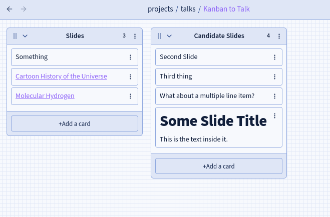

I do nearly all of my presentations in [RevealJS](https://revealjs.com/).  I originally picked it up sometime just before the pandemic, but then during 2020 I went all in and decided to make it my primary or exclusive means of giving talks.  (Actually, that timeline might not quite work out.  But who cares?  No one is going to fact check me!  It's snowing out and no one has time for that!)

For the longest time, I've wanted the ability to easily reuse slides between presentations, but also to override and modify the order, etc.  I've had a `figures` repository that I use to store the more complex figures I like to use in talks -- I deploy all my presentations to Github, so anything that lives on the same domain works fine for [CORS](https://en.wikipedia.org/wiki/Cross-origin_resource_sharing) etc.  (Usually.)

But what I *really* want was to have concepts that I can rearrange and put in different orders, and then use that to come up with sets of presentations.  This is super handy for classes, too -- the entire process of modularization of presentations and learning outcomes, and then arranging them easily and exporting to a presentation.

A couple weeks ago, I needed to develop a presentation and it hit me that I could do exactly this, and if I tried really hard, I might be able to make it work with a [Kanban-style](https://en.wikipedia.org/wiki/Kanban_board) interface.  I didn't quite have time [during the development of that talk](https://www.youtube.com/watch?v=aKUGQkyAMco) to implement it fully, but I got a good start on it and completed it a few days later.  I ended up building it in [Obsidian](https://obsidian.md), out of:

- [Slides Extended](https://github.com/ebullient/obsidian-slides-extended), a recent fork of the original [Advanced Slides](https://mszturc.github.io/obsidian-advanced-slides/) plugin
- [Obsidian Kanban](https://github.com/mgmeyers/obsidian-kanban), a really slick kanban-style interface backed by plain markdown
- [Templater](https://silentvoid13.github.io/Templater/introduction.html), one of the most essential plugins for any kind of automation in Obsidian

What I wanted was the ability to have one or more collections of slides that I could drag and drop into a presentation, and then to export that to a presentation file.  And it turns out, implementing this was not too hard after all!

I set up a directory in my vault under `projects` called `talks`, and under it I put a directory called `sequences`.  Each item in `sequences` is a `.md` file that contains the content of the slide or slides that comprise that 'sequence' or module.

>![warning]  
>These markdown files, at least for now, *cannot* include metadata or frontmatter sections.  This interferes with how the inclusions are parsed in `slides-extended` and it took me a while to figure that out.  
>**UPDATE**: Just as I was writing this, `ebullient` [fixed it](https://github.com/ebullient/obsidian-slides-extended/issues/69)!

So for example, inside my `What is yt.md` file, I have:

```
## Who Am I

+ Computational **astrophysicist** by training
+ Developed simulation platforms and analysis **tools** for astrophysics
+ Worked in interdisciplinary applications, study **communities** of practice in open source scientific software
+ Tenure-track at the School of Information Sciences, developing and implementing a **grammar** of volumetric analysis
```

The others can be more complicated, and in many I've included things like figures and multi-stage builds and the like.

Just as it is, this would allow creation of talks that are made up just by inclusions/embeddings of slides.  For example, by creating a note with this:

```
![[Some Slide]]

---

![[Another Slide]]
```

This views (and exports) just fine from slides-extended.  This is great!  But what I wanted to be able to do was to be a little more flexible and agile -- ideally, I'd have a Kanban board where I could drag and reorder "Some Slide" and "Another Slide" to be in a different order.  And, while I'm at it, it would be nice to be able to have a "library" of slides that I can move into a list and then export.

With the obsidian Kanban plugin, though, it turns out this is not overly hard to set up.  For instance, here is a Kanban board with a list called "Slides" and one called "Candidate Slides".



By using templater, we can set it up to iterate over the open document's list "Slides," convert all "just-a-link" entries to embeddings, and export to a new file.  For an added bonus, if the currently open document isn't a Kanban board, it won't do anything.

Here's my templater template:

```
---
aliases: []
tags:
  - talks/mine
created: 2023-09-13
modified: 2023-09-13
theme: mturk-slides
transition: none
center: false
fragments: true
hash: true
width: 1024
height: 768
margin: 0.02
defaultTemplate: "[[blankslide]]"
backgroundTransition: none
reveald3:
  - runLastState: false
enableTitleSlide: false
title: TITLE GOES HERE
presenterName: Matthew Turk
venueName: Unknown
talkDate: Unknown
---

# Title of the Talk Here

## Matthew Turk

<p data-markdown=true>School of Information Sciences<br/>
University of Illinois at Urbana-Champaign<br/>
<tt>mjturk@illinois.edu</tt><br/>
<tt>matthewturk.github.io</tt></p>

<!-- .slide: class="titleslide" -->

---
<%
const filePath = tp.config.active_file;
const converted = [];
if (filePath) {
	const p = dv.page(filePath.path)
	const f = p.file;
	if (p['kanban-plugin'] == 'board') {
		const items = f.tasks.filter(t => t.section.subpath == "Slides");
		items.forEach( i => {
			if (i.text.startsWith("[[") && i.text.endsWith("]]")) {
				converted.push(`!${i.text}`);
			} else {
				converted.push(i.text);
			}
		});
	}
}
-%>

<% converted.join("\n\n---\n\n") -%>

```

And just like that, I can rearrange slides, and then when I'm ready I press alt-n to create a new `talk-template` instance which takes my kanban board and converts to a full markdown note suitable for exporting as a full-on RevealJS presentation.
