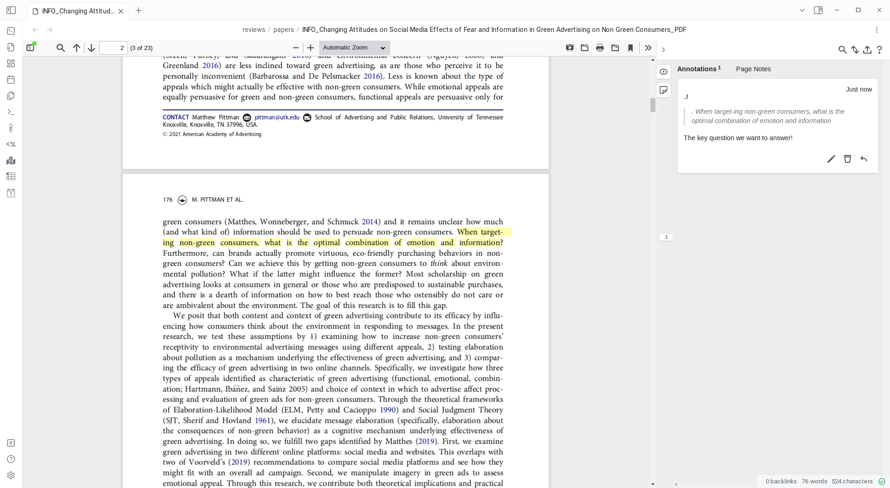

I've started keeping notes on papers in [Obsidian](https://obsidian.md/) and I thought I'd share the workflow, which so far is pretty straightforward and easy to set up.
This uses the [binary file manager](https://github.com/qawatake/obsidian-binary-file-manager-plugin) plugin and the [annotator](https://github.com/elias-sundqvist/obsidian-annotator) plugin.
Annotator uses [hypothes.is](https://hypothes.is/) with local storage (in markdown) of the annotations.

I set up a folder, `attachments/papers`, which is where I'll be putting all my PDFs.
I have this template, `templates/pdf-annotation`:

```
---
aliases: ["{{NAME}} - Annotation"]
type: pdf
fileClass: pdf-annotation
tags:
- pdf
- notes 
- paper 
created: {{NOW:YYYY-MM-DD}}
modified: {{NOW:YYYY-MM-DD}}
annotation-target: "{{PATH}}"
---

# {{FULLNAME}}
```

In the binary file manager plugin, I turn off *all* the file extensions *except* PDF, and I have the "New file location" set to `reviews/papers`.
That's where the metadata markdown files will go.
I point at `templates/pdf-annotation.md` for the template file location, and I turn on 'watch.'
(Note that there's an [open issue](https://github.com/qawatake/obsidian-binary-file-manager-plugin/issues/6) about having it only watch one particular directory, which I am going to enable if it gets implemented.  Not sure I will try implementing it myself.)
Whenever I have a PDF I want to store a local copy of, I drag it into the `attachments/papers` directory, and the metadata file gets created.
Then I open up the newly created file, and I have a side-by-side annotation view!



I *think*, but I'm not totally sure, that with a little bit of work it should be possible to make this work without much change (using the same template, location, etc) for online annotations too, which I'm going to have a shot at.
Annotator supports remote URLs, so the work would just be in making sure I can use the same template both ways.
