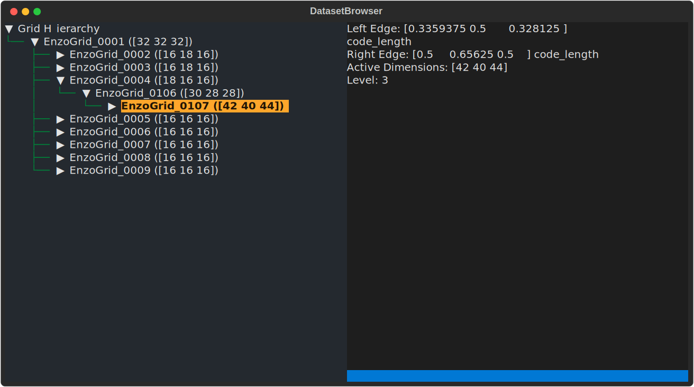

I've recently been having fun with [yt](https://yt-project.org/) again.  Really, though, I've been having fun exploring the ways I can use it from different perspectives, and using it to teach myself the library [textual](https://textual.textualize.io/).

A long, long time ago, when we were much younger (around the time Streetlight Manifesto put out their first album, "Everything Goes Numb") I started trying to learn and use [Enzo](https://enzo-project.org/).  Enzo outputs data in patch-structured refinement, so you have grids that overlap and whatnot and aren't all the same size.  The way it outputs it to disk is with a `.hierarchy` file, which is essentially a serialization of the simulation code 'walking' the hierarchy.  So, it outputs grid information, like so:

```
Grid = 1
Task              = 0
GridRank          = 3
GridDimension     = 38 38 38 
GridStartIndex    = 3 3 3 
GridEndIndex      = 34 34 34 
GridLeftEdge      = 0 0 0 
GridRightEdge     = 1 1 1 
Time              = 0.0060000200028298
SubgridsAreStatic = 0
NumberOfBaryonFields = 24
FieldType = 0 4 5 6 1 49 50 51 52 53 7 8 9 10 11 12 23 24 25 27 19 61 62 83 
BaryonFileName = ./DD0030/galaxy0030.cpu0000
CourantSafetyNumber    = 0.300000
PPMFlatteningParameter = 0
PPMDiffusionParameter  = 0
PPMSteepeningParameter = 0
NumberOfParticles   = 0
GravityBoundaryType = 1
Pointer: Grid[1]->NextGridThisLevel = 0
Pointer: Grid[1]->NextGridNextLevel = 2
```

This is the first grid in my old favorite, `IsolatedGalaxy`.  The various parameters include things like the position of the grid in space and so forth, and then at the end, we have these two pointers to the next grid on *this* level and the next grid on the *next* level.  These two lines are the way that Enzo communicates parentage relationships (and note that `Level` is not in the block -- you track which level things are on by walking the hierarchy.)  The first line here indicates that there are no additional grids on this level, and the second line indicates that the next level starts with grid index 2.  The grids are always ordered in this way -- siblings first, then children.  That's how you end up with blocks like this:

```
Grid = 19
Task              = 5
GridRank          = 3
GridDimension     = 14 10 14 
GridStartIndex    = 3 3 3 
GridEndIndex      = 10 6 10 
GridLeftEdge      = 0.52734375 0.53515625 0.505859375 
GridRightEdge     = 0.53515625 0.5390625 0.513671875 
Time              = 0.0060000200028298
SubgridsAreStatic = 0
NumberOfBaryonFields = 24
FieldType = 0 4 5 6 1 49 50 51 52 53 7 8 9 10 11 12 23 24 25 27 19 61 62 83 
BaryonFileName = ./DD0030/galaxy0030.cpu0005
CourantSafetyNumber    = 0.300000
PPMFlatteningParameter = 0
PPMDiffusionParameter  = 0
PPMSteepeningParameter = 0
NumberOfParticles   = 50
ParticleFileName = ./DD0030/galaxy0030.cpu0005
GravityBoundaryType = 2
Pointer: Grid[19]->NextGridThisLevel = 0
Pointer: Grid[19]->NextGridNextLevel = 0
Pointer: Grid[18]->NextGridNextLevel = 0
Pointer: Grid[17]->NextGridNextLevel = 0
Pointer: Grid[16]->NextGridNextLevel = 0
Pointer: Grid[15]->NextGridNextLevel = 20
```

Here, we are in grid 19, but it doesn't have any *additional* siblings, and it also doesn't have any children.  Grids 18, 17, and 16 also do not have any child grids, but 15 does.

As you might imagine, while this makes sense and is also straightforward to de-serialize into an in-memory data structure, it can be somewhat tricky to navigate if you just want info about a particular grid and its relationship to other grids.

Enter, Britton Smith!  Britton, who I had the pleasure of attending graduate school with (and, also, continuing to work with up to and including the present day), was a really slick perl script writer.

(His perl implementation of battleship, including socket communication across LAN machines and a high score table, was a fixture among the PSU astro grads.)

Britton wrote up a tool to parse the hierarchy and, if I am remembering correctly, present a simple REPL to query for information about the individual grids.  Years later he helped me port this concept to Python where it forms the initial indexing stage of the yt Enzo frontend.

A little while ago, I saw [a toot](https://mastodon.social/@glyph/110431920038948565) by Glyph Lefkowitz that made me realize I really ought to give a look at [textual](https://textual.textualize.io/) again.

So I built out a very simple Enzo hierarchy explorer that used yt, to try to evoke the old perl script.  And it turns out, it was ... incredibly easy!

I ended up putting it on GitHub at [matthewturk/yt_hierarchy_browser](https://github.com/matthewturk/yt_hierarchy_browser).  I've started exploring using things like [rich-pixels](https://github.com/darrenburns/rich-pixels) to display grid slices, but I started to get lost in the "messages flow up and properties flow down" side of things, and making sure that I had the grid images properly stored in the right places.  I will probably come back to that.

For now, though, the basics of the app are reasonably small -- three basic components.  The first is the `App` subclass, which sets up the tree viewer on the left and the grid info viewer on the right:

```python
class DatasetBrowser(App):
    CSS_PATH = "yt_hierarchy_browser.css"

    def compose(self) -> ComposeResult:
        yield Header()
        yield Footer()
        yield GridHierarchyBrowser()
        yield GridViewer()

    def on_mount(self) -> None:
        ghv = self.query_one(GridHierarchyBrowser)
        ds = yt.load_sample("IsolatedGalaxy")
        assert ds is not None
        ghv.dataset = ds

    def on_tree_node_highlighted(self, event: Tree.NodeHighlighted) -> None:
        if event.node.data is None: return
        gv = self.query_one(GridViewer)
        gv.grid = event.node.data['grid']

```

(I'm not sure I've put my tree node highlighted event handler in the right level of the class structure, but like I said, I'm still learning!)  This then creates a `GridViewer` which handles the display whenever a grid is highlighted:

```python
class GridViewer(Static):
    grid: reactive[AMRGridPatch | None] = reactive(None)

    def compose(self):
        yield Static(id = "grid_info")
        yield Static(id = "grid_view")

    def watch_grid(self, grid: AMRGridPatch) -> None:
        if grid is None: return
        grid_info = self.query_one("#grid_info")
        grid_info.update(f"Left Edge: {grid.LeftEdge}\n"
                         f"Right Edge: {grid.RightEdge}\n"
                         f"Active Dimensions: {grid.ActiveDimensions}\n"
                         f"Level: {grid.Level}\n")
```

Note here that it's getting a grid patch, which gets updated -- I could also do this with the tree node data, but here I'm passing the grids so that when I do image display it's a bit easier.  And finally, the tree viewer itself:

```python
class GridHierarchyBrowser(Static):
    dataset: reactive[Dataset | None] = reactive(None)

    def compose(self) -> ComposeResult:
        yield Tree(label = "Grid Hierarchy", id = "grid_hierarchy")

    def watch_dataset(self, dataset: Dataset) -> None:
        if dataset is None: return
        def dictify(g):
            return {'ActiveDimensions': g.ActiveDimensions,
                    'LeftEdge': g.LeftEdge,
                    'RightEdge': g.RightEdge,
                    'Level': g.Level,
                    'grid': g}
        tree: Tree[dict] = self.query_one(Tree)
        tree.root.expand()
        def add_children(node, g):
            data = dictify(g)
            if len(g.Children) == 0:
                node.add_leaf(str(g), data = data)
            else:
                n = node.add(str(g), data = data)
                for c in g.Children:
                    add_children(n, c)
        for grid in dataset.index.select_grids(0):
            # These are all the root grids
            node = tree.root.add(str(grid), data = dictify(grid), expand = True)
            for c in grid.Children:
                add_children(node, c)
```

Again, the creation of the `dict` is a bit redundant since I'm also grabbing the grid info, but later on I hope that will come in useful.  This simply watches the dataset and then fills up the nodes.  And, this is what it looks like:



This was a pretty fun experiment, and I'm pretty excited about exploring more with it.
