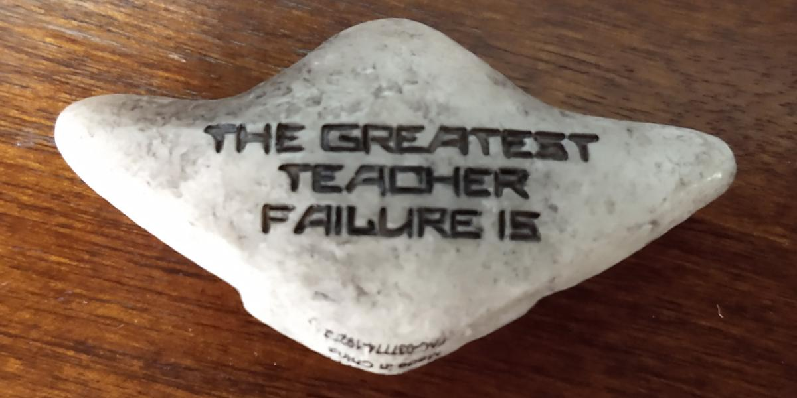

+++
title = "Reflections on Failing"
subtitle = ""

# Add a summary to display on homepage (optional).
summary = ""

date = 2021-06-01T12:00:00-05:00
draft = false

# Authors. Comma separated list, e.g. `["Bob Smith", "David Jones"]`.
authors = []

# Is this a featured post? (true/false)
featured = false

# Tags and categories
# For example, use `tags = []` for no tags, or the form `tags = ["A Tag", "Another Tag"]` for one or more tags.
tags = []
categories = []

# Projects (optional).
#   Associate this post with one or more of your projects.
#   Simply enter your project's folder or file name without extension.
#   E.g. `projects = ["deep-learning"]` references 
#   `content/project/deep-learning/index.md`.
#   Otherwise, set `projects = []`.
# projects = ["yt"]

# Featured image
# To use, add an image named `featured.jpg/png` to your page's folder. 
[image]
  # Caption (optional)
  caption = ""

  # Focal point (optional)
  # Options: Smart, Center, TopLeft, Top, TopRight, Left, Right, BottomLeft, Bottom, BottomRight
  focal_point = ""
+++

&nbsp;|&nbsp; 
-|-
|

This year I had to submit my "third year review."
It's not actually my third year, but thanks to having a (second) kid, and also the global pandemic, and a bunch of other stuff, I'm only doing it now.
I did not quite expect it to be quite as deflating as it turned out to be, but, y'know, [sometimes](https://www.youtube.com/watch?v=aPVLyB0Yc6I).
Turns out, trying to distill everything you care about into three pages, and also then all your accomplishments into what amounts to a spreadsheet (in prose form) can feel a bit reductive!

Also, I turned 0x28, which is a milestone birthday, so that's probably adding on some Feelings.
I got myself that little tchotchke above, featuring a quotation from my favorite Star Wars movie that I found rather inspirational.

> [Heeded my words not, did you? Pass on what you have learned. Strength. Mastery. But weakness, folly, failure also. Yes, failure most of all. The greatest teacher, failure is. Luke, we are what they grow beyond. That is the true burden of all masters.](https://www.youtube.com/watch?v=6fek6iJlm8s)

That's the quotation that has stuck with me the most -- but the one that hit me the hardest during the movie was somewhat different.

> [You think what? I'm gonna walk out with a laser sword and face down the whole First Order?](https://getyarn.io/yarn-clip/66f7667f-961e-499e-b894-95f027fe20d7)

I could probably write an awful lot about how I was feeling, then, in the waning days of 2017, and why these specific things hit me so hard, but I'm going to instead take a few minutes to walk through -- and explore, here, in a public place where I can't really hide from judgment -- some thoughts about failure, and why, and what, and how to move on.

(It's a bit easier to write this, knowing that no one reads this blog, though.
So, if you saw this because I tweeted it out, I guess I underestimated my capacity for self-promotion?)

## What do you mean by ... "Failure"?

Yeah, OK, this is the big one, right?
I mean, the entire rest of the blog post will hinge on this, I guess.
But I'll explain by describing both the system I find myself in, and the way that has kind of warped my view.
Maybe?
I dunno.

Anyway the long and the short is, I have long thought about my life, and my goals, in terms of what I want to have accomplished.
And, a fair bit of that is tied up into [yt](https://yt-project.org/), and the impact I have wanted it to have on computational astrophysics and beyond.
I was reflecting on it this morning when I attended a meeting of the virtual observatory about platforms for delivering data from simulations.

## Oh, is *that*, why you are writing this?

Alright, alright, y'all got me.  I am indeed writing this because I felt like "Hey, what the heck, it feels like we've solved this problem!"
But ... I think the fact that I had this reaction said far more about me than it did about the "solution" I had in mind, or about my "success."

## Modes of Failure

## 
